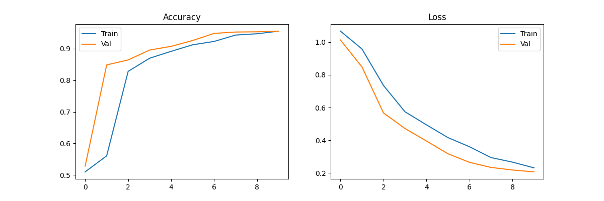
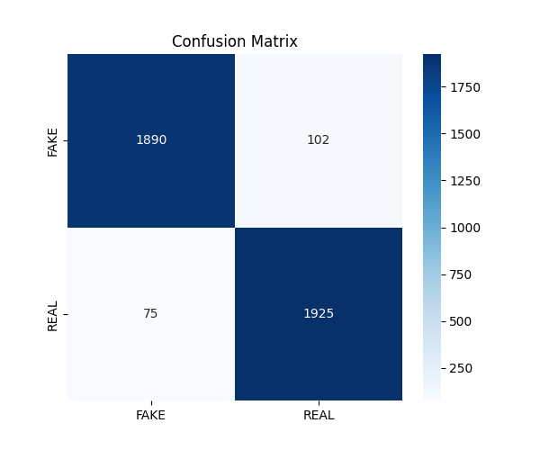

# 📰 Fake News Detection System

A machine learning-based web application that detects whether a news article is **real or fake** using an LSTM deep learning model.

---

## 🚀 Features

* 🔍 Detect fake vs real news instantly
* 🧠 Trained using LSTM (Deep Learning)
* 📊 Visual performance metrics (accuracy, loss, confusion matrix)
* 🌐 Interactive web interface
* ⚡ Fast and simple predictions

---

## 🛠️ Tech Stack

* **Python**
* **TensorFlow / Keras**
* **Streamlit** (for web app)
* **NumPy / Pandas**
* **Scikit-learn**

---

## 📂 Project Structure

```
Fake-News-Detection/
│
├── app.py                # Main app
├── model_lstm.py        # Model architecture
├── preprocess.py        # Text preprocessing
├── utils.py             # Helper functions
├── requirements.txt     # Dependencies
├── README.md
├── .gitignore
│
├── pages/               # Additional UI pages
├── static/              # Images (graphs, results)
├── dataset/             # Dataset (optional)
```

---

## 🧠 Model Details

* Model: **LSTM (Long Short-Term Memory)**
* Task: Binary Classification (Fake / Real)
* Input: News article text
* Output: Prediction with confidence score

---

## 📊 Model Performance

### 📈 Training Curves



### 📉 Confusion Matrix



---

## ⚙️ Installation & Setup

### 1️⃣ Clone the repository

```
git clone https://github.com/your-username/fake-news-detection.git
cd fake-news-detection
```

### 2️⃣ Create virtual environment

```
python -m venv venv
venv\Scripts\activate
```

### 3️⃣ Install dependencies

```
pip install -r requirements.txt
```

### 4️⃣ Run the app

```
streamlit run app.py
```

---

## 📌 Usage

1. Open the web app
2. Enter a news article
3. Click **Predict**
4. Get instant result: **Fake or Real**

---

## ⚠️ Notes

* Model files (`.h5`, `.pkl`) may not be included due to size limits
* If missing, download from provided link (add yours here)

---

## 🎯 Future Improvements

* Improve model accuracy with larger dataset
* Add real-time news API integration
* Deploy on cloud (Streamlit Cloud / AWS)
* Add explainability (why prediction was made)

---

## 👨‍💻 Author

Your Name

---

## ⭐ If you like this project

Give it a star ⭐ on GitHub!
